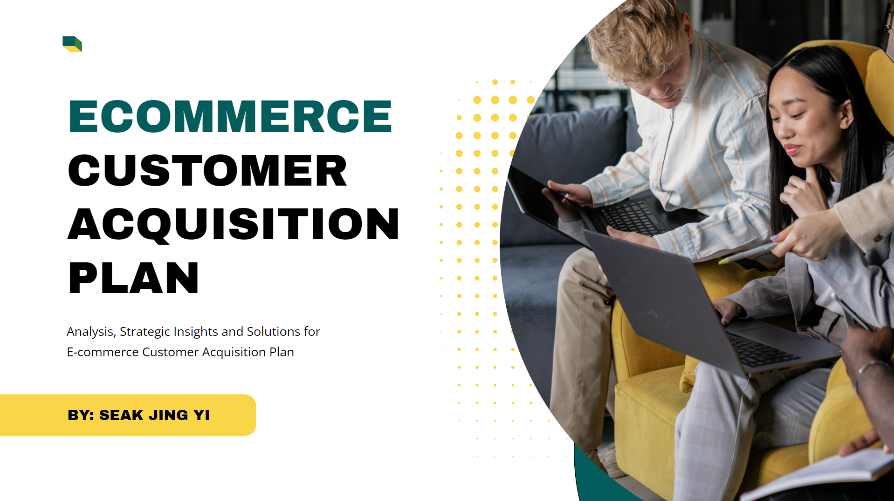

<h1 align="center">
    
</h1>
<h3 align="center">Exploring new ways on how data can excite my life!</h3>
 

## About Me 👨🏻‍💻

**Hello!**
I was a media planner for 4 years and I wanted to complement my media planning skills with something new, exciting, and creative. Leveraging on my existing skills to extract insights from campaigns, automate workflows, and build impactful visualizations, I found just the perfect role for that: a Data Analyst! I've started to become proficient in optimizing SQL queries, writing Python scripts for analytics, and using Tableau dashboards to make informed strategic decisions. Ultimately, my role as a Data Analyst is to focused on solving business challenges and uncover growth opportunities through the numbers and figures, and I aim to achieve that through these new skills.

Stay tuned for more updates as I continue to hone my technical skills in SQL, Python, Tableau and more, while exploring how Data can bring a new sense of adventure and excitement into my life!

### Techincal Skills 🛠️

**Data Extraction & Cleaning:** SQL, Excel, Python (Pandas, NumPy) 
**Data Visualisation:** Tableau, Power BI, Python (MatPlotLib, Plotly) 
**Forecasting Models:** Python (Prophet, ARIMA, SARIMA) 
**Machine Learning:** Python (Linear Regression, Collaborative Filtering) 

## Data Projects 🖥️

[General Assembly Capstone Project](https://github.com/MatthiasJY/GA_Capstone)

This project was done with a dataset of an E-commerce company found on Kaggle. 

**The Problem Statement:** The upper management of this E-commerce company is looking to attract new customers to shop on their online marketplace. 
After some internal investigation and research, the upper management of the company concluded that they would need a new personalised shopping experience for each customer, and also a more personalised or localised marketing when it comes to the products themselves. Gone are the days where marketing and experiences can be generic. Thus, they would like to know how these 2 issues can be solved.  

**Project Summmary:** In this project, I created a Transaction forecasting model and a Recommendation System with Collaborative Filtering using Python. 
The Transcation forecasting model will allow the company to predict the total transactions for the next 6 months, based on each individual Product and State. This will allow the marketing to be more specific and localised.  
The Recommendation System will provide both new and exsiting customer a more personalised shopping experience as they will be recommended products for upselling based on other customers who are similar to them. 

View more details in the link above!

***Work in Progress*** ⚠️

**<u>The Restaurant Recommender</u>**

I'm currently creating a Content Based Recommendation System to recommend the next restaurant to visit with my friends based on the places that received a high rating from us. The idea I have is to make use of Google Maps API to retrieve a list of restaurants in Singapore, rank them based on locations (North, South, East, West), and Google Ratings, and hopefully (not sure if it's possible) rank them based on cusine dynamically. The end result is to creat a model that can recommend the next restaurant that has a high review, not too inaccessible, which also serves a cuisine that has received a high rating from us recently.

## Let's Connect 📬

I'm always excited to collaborate, discuss new ideas, or explore interesting projects. Feel free to reach out here! 
Looking forward to connecting with you!
